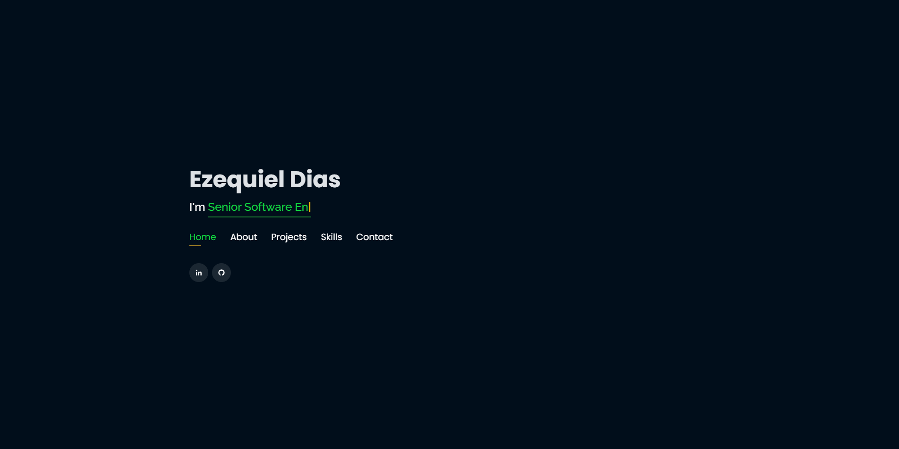

# Personal Portfolio 🔥 Nuxt.JS + Vite + Docker

:star: Star me on GitHub — it helps!

### Website Preview
#### Home Page

## Features 📋
⚡️ Nuxt.js 3 (Vue.JS 3)\
⚡️ Eslint\
⚡️ Docker\
⚡️ Page Animations\
⚡️ Fully Responsive\
⚡️ Valid HTML5 & CSS3\
⚡️ Typing animation using `Typed.js`\
⚡️ Easy to modify

## Sections 📚
✔️ About\
✔️ Interests\
✔️ Projects \
✔️ Skills \
✔️ Contact Info

## License

- **[MIT license](http://opensource.org/licenses/mit-license.php)**
